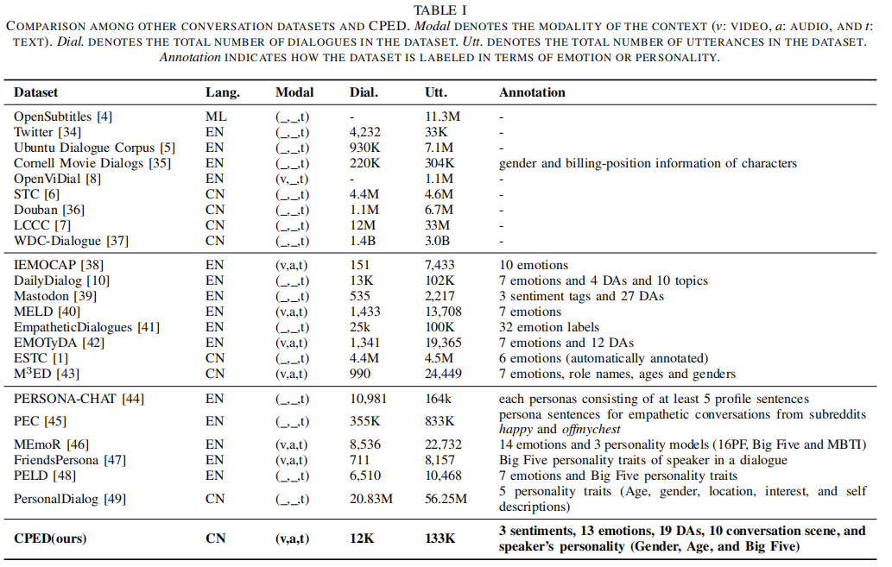

# [CPED](https://github.com/scutcyr/CPED)
[](#python) [](https://github.com/scutcyr/CPED/stargazers) [](https://github.com/scutcyr/CPED/blob/main/LICENSE)  [](https://github.com/psf/black) 

README: [English](https://github.com/scutcyr/CPED/blob/main/README.md) | [中文](https://github.com/scutcyr/CPED/blob/main/README-zh.md)    
该仓库提供下面的论文的实现细节：    
**[CPED: A Large-Scale Chinese Personalized and Emotional Dialogue Dataset for Conversational AI](https://arxiv.org/abs/2205.14727)**  

更多信息请参考我们的[论文](https://arxiv.org/abs/2205.14727)。

## <a name="#Contents">目录</a>
* <a href="#Introduction">简介</a>
* <a href="#Dataset">数据集统计学特性</a>
* <a href="#Task">任务定义</a>
* <a href="#Evaluation">实验结果</a>
* <a href="#Usage">使用方法</a>

## <a name="#Introduction">简介</a>
我们构建了一个命名为**CPED**的数据集，该数据集源于40部中文电视剧。
CPED包括与情感、个性特质相关的多源知识，包括：13类情绪、性别、大五人格、19类对话动作以及其他知识。下表给出了CPED与其他常见数据集的比较。    

* 我们构建了一个多轮的中文个性情感对话数据集CPED。据我们所知，CPED是首个中文个性情感对话数据集。它包括超过1.2万个对话，超过13.3万个语句，并且是多模态的。因此，该数据集可以用在复杂的对话理解任务以及拟人化的对话生成任务研究。
* CPED提供了3类属性标注（姓名、性别、年龄），大五人格特质标注，2类情感标注（3分类粗粒度情感、13分类细粒度情感），以及对话动作DA标注。人格特质和情感可以用作开放域对话生成的先验外部知识。提升对话系统的拟人化水平。
* 我们在论文中提出了3个任务：对话中的人格识别（PRC），对话中的情感识别（ERC），以及个性情感对话生成（PEC），一系列实验验证了人格以及情感对于对话生成的重要性。



## <a name="#Dataset">数据集统计学特性</a>
为了让对话系统学习情感表达和个性表达能力，我们提供了下表中列出的多种类型的注释标签。

| # of annos. | Labels | Num. |
|:-----------:|:-------|:----:|
| Sentiment | positive, neutral, and negative | 3 |
| Emotion | happy, grateful, relaxed, other-positive, neutral, angry, sad, feared, depressed, disgusted, astonished, worried and other-negative | 13 |
| Gender | male, female, and unknown | 3 |
| Age group | children, teenager, young, middle-aged, elderly and unknown | 6 |
| Big Five | high, low, and unknown | 3 |
| DA | greeting (g), question (q), answer (ans), statement-opinion (sv), statement-non-opinion (sd), apology (fa), command (c), agreement/acceptance (aa), disagreement (dag), acknowledge (a), appreciation (ba), interjection (ij), conventional-closing (fc), thanking (ft), quotation (^q), reject(rj), irony (ir), comfort (cf) and other (oth) | 19 |
| Scene | home, office, school, mall, hospital, restaurant, sports-venue, entertainment-venue, car, outdoor and other-scene | 11 |


CPED数据集中性别、年龄、3分类情感、13分类细粒度情绪和DA的统计学分布如下图所示。


 The statistics of CPED are listed in the following table.
| 统计项                   | 训练集   | 验证集     | 测试集    |
|-----------------------|---------|---------|---------|
| 模态                     | (v,a,t) | (v,a,t) | (v,a,t) |
| 电视剧                   | 26      | 5       | 9       |
| 对话                     | 8,086   | 934     | 2,815   |
| 语句                     | 94,187  | 11,137  | 27,438  |
| 说话人                   | 273     | 38      | 81      |
| 每个对话的平均句子数       | 11.6    | 11.9    | 9.7     |
| 对话的最大句子数           | 75      | 31      | 34      |
| 每个对话的平均情感类别数   | 2.8     | 3.4     | 3.2     |
| 每个对话的平均DA类别数    | 3.6     | 3.7     | 3.2     |
| 平均句子长度             | 8.3     | 8.2     | 8.3     |
| 最大句子长度             | 127     | 42      | 45      |
| 语句的平均语音长度       | 2.1s    | 2.12s   | 2.21s   |


## <a name="#Task">任务定义</a>  
CPED可以用于对话理解任务和对话生成任务的评估，例如说话人建模、对话中的个性识别、对话中的情感识别、对话中的DA识别、回复的情感预测、情感对话生成、个性会话生成、移情对话生成等，CPED还可以应用于多模态人格或情感识别、多模态对话生成。它将对促进认知智能的发展起到积极的作用。
我们在本项目当中引入3种任务，如下所示:   
* **ERC**: 对话中的情感识别任务
* **PRC**: 对话中的人格（个性）识别任务
* **PEC**: 个性情感对话生成任务  


## <a name="#Usage">使用方法</a>
如果你使用conda配置虚拟环境，你可以通过以下命令创建运行baseline模型的python虚拟环境:   
```bash
cd envs # 切换到envs目录
conda env create -n py38_cped --file py3.8_torch1.9.0_ignite0.4.8_tensorflow2.2.0_cuda10.2_transformers4.18.0_paddlepaddle-gpu_2.3.0.yml
```

部分依赖包的使用版本如下所示:   
```bash
python=3.8
torch==1.9.0+cu102 
torchvision==0.10.0+cu102 
torchaudio==0.9.0
tensorflow==2.2.0
tensorboard==2.2.2
transformers==4.18.0
paddlepaddle-gpu==2.3.0
pytorch-ignite==0.4.8
matplotlib==3.5.2
notebook==6.4.11
pandas==1.4.2
chardet==4.0.0
nltk==3.7
bert-score==0.3.11
```


如果你在研究当中使用到CPED数据集或者本项目，请引用以下论文:    
```
@article{chen2022cped,
	title={{CPED}: A Large-Scale Chinese Personalized and Emotional Dialogue Dataset for Conversational AI},
	author={Yirong Chen and Weiquan Fan and Xiaofen Xing and Jianxin Pang and Minlie Huang and Wenjing Han and Qianfeng Tie and Xiangmin Xu},
	journal={arXiv preprint arXiv:2205.14727},
	year={2022},
	url={https://arxiv.org/abs/2205.14727}
}
```

>>> 人体数据感知教育部工程研究中心